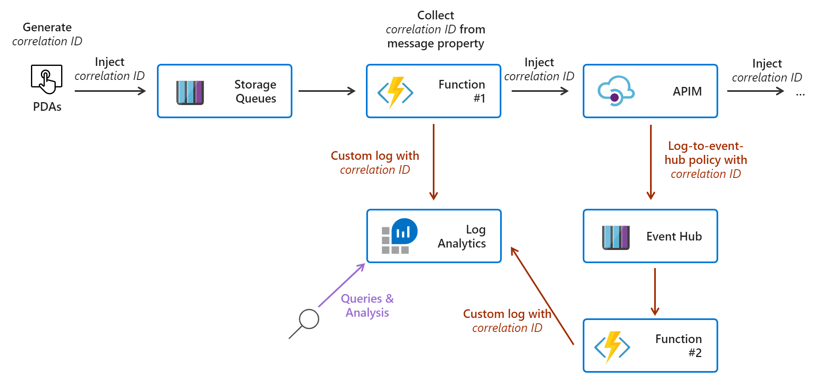

# Distributed tracing Using Functions and Log Analytics

This was a prove of concept using an possible workload.

Requirements:

- The message posted to the Rest API needs to be easily traceble end to end.
- The architecture must be cost-effective
- The achitecture needs to scale fast if needed

## Function to process Queue

Function to consume queue data add a custom currelation ID and post to Azure API Management.

<https://github.com/thiagofborn/queueTriggerToSendPost>

## Function to read from Azure Event Hubs

Function that reads from Azure Event Hubs and sends the information formated to a specific case to Azure Log Analytics.

<https://github.com/thiagofborn/eventHubsTriggerLogAnalytics>
